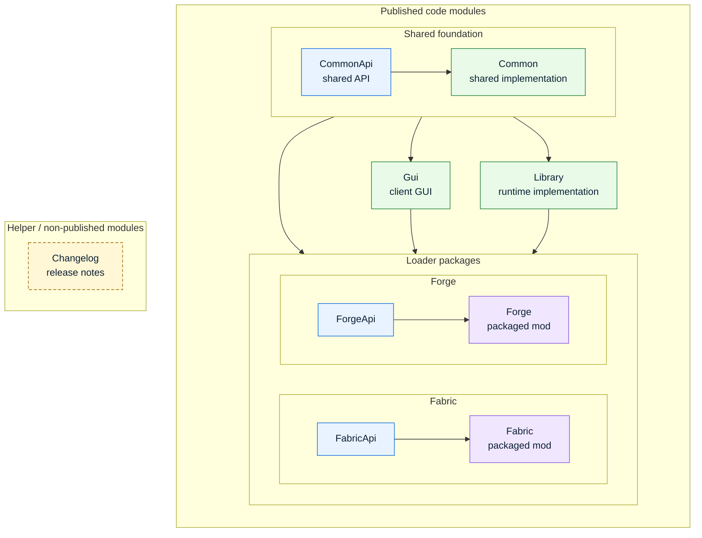

# Contributing to JEI

Thanks for helping improve JEI. Please keep pull requests focused and target the latest active Minecraft branch. Changes can be backported to older supported branches after they are reviewed and merged.

## Pull requests

Keep each pull request scoped to one fix, feature, or cleanup. Avoid mixing unrelated refactors, formatting-only changes, dependency updates, and behavior changes in the same pull request.

Describe the problem being fixed, the behavior change, and how you tested it. Link the relevant issue when one exists.

Do not include build outputs, logs, run directories, generated IDE files, or release artifacts.

## Formatting

JEI uses Spotless to enforce Java formatting. Before opening or updating a pull request, run:

```shell
./gradlew spotlessApply
```

To verify formatting without changing files, run:

```shell
./gradlew spotlessCheck
```

## Tests

Pull requests that change production Java code should include relevant tests or game tests in the same pull request.

If a production-code change does not need a test, explain why in the pull request description. A maintainer can apply the `no-tests-needed` label to bypass the automated test-change check.

Useful local test commands:

```shell
./gradlew test
./gradlew :Fabric:runClientGameTest
```

Client game tests require a graphical environment. On Linux CI they run through `xvfb-run`.

## API compatibility

Preserve API compatibility by default. Avoid removing, renaming, or changing public API methods and types. Prefer additive APIs and long deprecation windows when migration is needed.

Breaking API changes require a JEI major version bump and should only be considered for Minecraft-version updates.

## Code organization

Keep changes in the module that owns the behavior. Avoid moving code between Common, Gui, Library, Fabric, Forge, and API modules unless the change specifically requires it.

Subproject relationships are grouped by published code modules and helper modules:



When adding Java code in a new package or source root, add the usual `package-info.java` with package annotations matching nearby code.

Avoid build tooling, Java version, dependency, publishing, and version-number changes unless the pull request is specifically about that infrastructure.
